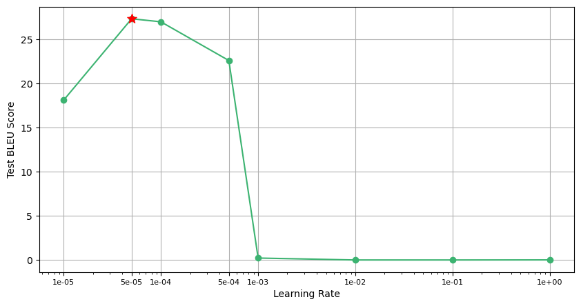
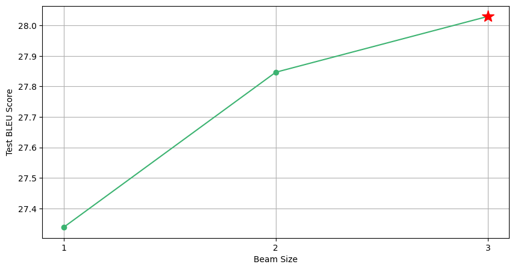

# Enhancing English-Chinese Translation: Advanced Preprocessing and Optimization Techniques

Final Project for Georgia Tech ECE 6254. [Presentation Link](https://www.youtube.com/watch?v=WFFm3jYRt_Q)

Group member: Zirui Chen, Genyuan Liu, Xuanzhou Chen, Chengyue Huang, Miao Li

This is a **Transformer** based neural machine translation(**NMT**) model.

## Data

The dataset is from [WMT 2018 Chinese-English track](http://statmt.org/wmt18/translation-task.html) (Only NEWS Area)

## Data Process

### Word Segmentation

- **Tool**：[sentencepiece](https://github.com/google/sentencepiece)
- **Preprocess**：Run `./data/get_corpus.py` , in which we will get bilingual data to build our training, dev and testing set.  The data will be saved in `corpus.en` and `corpus.ch`, with one sentence in each line.
- **Word segmentation model training**: Run `./tokenizer/tokenize.py`, in which the *sentencepiece.SentencePieceTrainer.Train()* mothed is called to train our word segmentation model. After training, `chn.model`，`chn.vocab`，`eng.model` and `eng.vocab` will be saved in `./tokenizer`.  `.model` is the word segmentation model we need and `.vocab` is the vocabulary.

## Model

We use the open-source code [transformer-pytorch](http://nlp.seas.harvard.edu/2018/04/03/attention.html) developmented by Harvard.

## Requirements

This repo was tested on Python 3.6+ and PyTorch 1.5.1. The main requirements are:

- tqdm
- pytorch >= 1.5.1
- sacrebleu >= 1.4.14
- sentencepiece >= 0.1.94

To get the environment settled quickly, run:

```
pip install -r requirements.txt
```

## Usage

Hyperparameters can be modified in `config.py`.

- This code supports MultiGPU training. You should modify `device_id` list in  `config.py` and `os.environ['CUDA_VISIBLE_DEVICES']` in `main.py` to use your own GPUs.

To start training, please run:

```
python main.py
```

The training log is saved in `./experiment/train.log`, and the translation results of testing dataset is in `./experiment/output.txt`.

> Training on 1 A40, 20min/epoch.

## Results

### Effect of Learning Rate


### Effect of Beam Size


### Effect of Optimization Methods
| Model | NoamOpt | LabelSmoothing | Test Bleu |
| :---: | :-----: | :------------: | :-----------: |
|   1   |   No    |       No       |     28.0297     |
|   2   |   Yes   |       No       |   27.1831   |
|   3   |   No    |      Yes       |     **28.3410**     |
|   4   |   Yes    |      Yes       |     27.8533     |

## One Sentence Translation

Name the pretrained model or your own trained model with `model.pth` and save it in the path `./experiment`. Run `translate_example` method in `main.py`, and then you can get one sentence translation result.

English Input Sentence for example:

```
The near-term policy remedies are clear: raise the minimum wage to a level that will keep a fully employed worker and his or her family out of poverty, and extend the earned-income tax credit to childless workers.
```

ground truth:

```
近期的政策对策很明确：把最低工资提升到足以一个全职工人及其家庭免于贫困的水平，扩大对无子女劳动者的工资所得税减免。
```

Translation result with beam size = 3:

```
短期政策方案很清楚:把最低工资提高到充分就业的水平,并扩大向无薪工人发放所得的税收信用。
```

